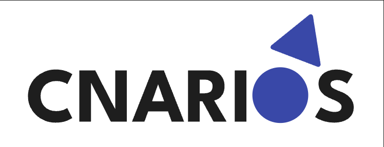
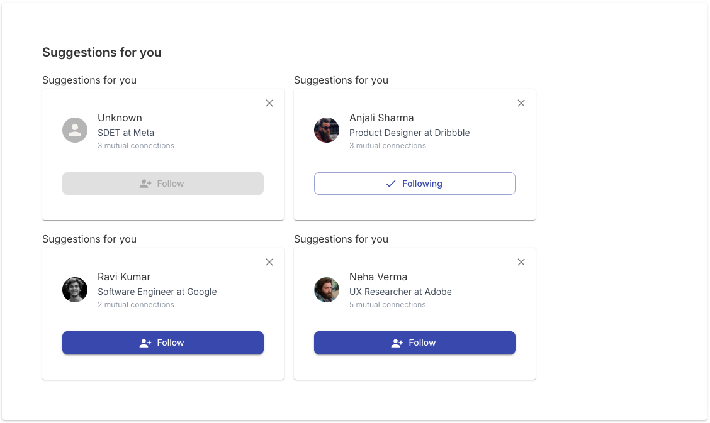
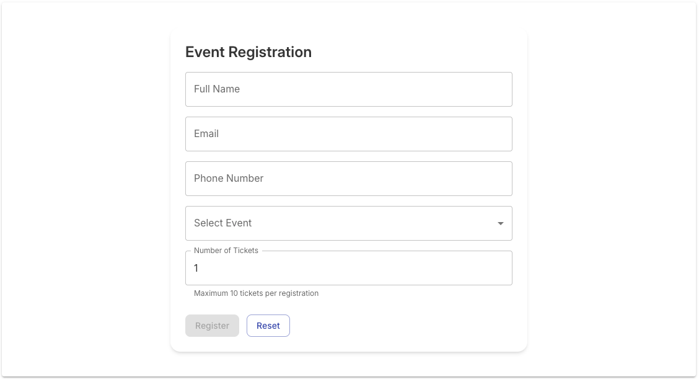
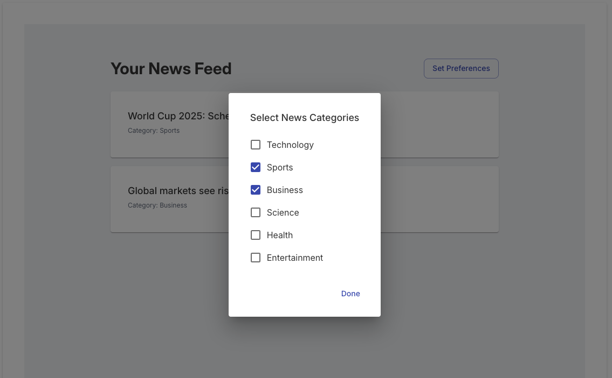

# [Cnarios](https://www.cnarios.com/) in Playwright

🚀 Challenges and real-world scenarios to learn automation using Playwright

## What is Cnarios ?

📋 Cnarios is a free platform for testers to practice automation using real-life scenarios, industry-standard test cases, and bug-finding challenges. Learn concepts, sharpen your skills, and prepare for interviews — all in one place.

👉 [www.cnarios.com](https://www.cnarios.com/)

## Challenges

Each challenge will include positive test cases, negative test cases, and edge cases.

    
Button
 
    
😎👌🔥 Positive Scenarios and Edge Cases

    <table>
        <tr>
            <th>Test ID</th>
            <th>Scenario</th>
            <th>Expected Result</th>
            <th>Type</th>
            <th>Priority</th>
        </tr>
        <tr>
            <td>BTN_001</td>
            <td>Click Follow button when enabled</td>
            <td>Button text and icon should change to 'Following' with a check icon</td>
            <td>Positive</td>
            <td>High</td>
        </tr>
        <tr>
            <td>BTN_002</td>
            <td>Tooltip visibility on hover</td>
            <td>Tooltip should display 'Click to follow' or 'Click to unfollow' based on state</td>
            <td>Positive</td>
            <td>Medium</td>
        </tr>
        <tr>
            <td>BTN_003</td>
            <td>Follow button shows 'Processing...' text</td>
            <td>'Processing...' should appear before state changes and the button should be disabled</td>
            <td>Positive</td>
            <td>Medium</td>
        </tr>
        <tr>
            <td>BTN_004</td>
            <td>Click Unfollow (toggle back)</td>
            <td>Button should return to Follow state after click</td>
            <td>Positive</td>
            <td>Medium</td>
        </tr>
        <tr>
            <td>BTN_005</td>
            <td>Remove a suggestion card</td>
            <td>The selected suggestion card should be removed from the visible list</td>
            <td>Positive</td>
            <td>Medium</td>
        </tr>   
    </table>
    
🚨❗🚫 Negative Scenarios and Edge Cases

    <table>
        <tr>
            <th>Test ID</th>
            <th>Scenario</th>
            <th>Expected result / risk identified</th>
            <th>Type</th>
            <th>Priority</th>
        </tr>
        <tr>
            <td>BTN_006</td>
            <td>Unable to follow if button is desabled</td>
            <td>Button text should not change on click if button is desabled</td>
            <td>Negative</td>
            <td>Medium</td>
        </tr> 
        <tr>
            <td>BTN_007</td>
            <td>Ignore clicks near button (missed clicks)</td>
            <td>User action is not precise</td>
            <td>Negative</td>
            <td>Medium</td>
        </tr>
        <tr>
            <td>BTN_008</td>
            <td>Unable to follow if button is clicked multiple times (spam/debounce)</td>
            <td>Button is put under stress</td>
            <td>Negative</td>
            <td>Medium</td>
        </tr> 
        <tr>
            <td>BTN_009</td>
            <td>Button remains functional when visually hidden</td>
            <td>Button is visually hidden</td>
            <td>Negative</td>
            <td>Medium</td>
        </tr>  
    </table>
    
🏞️ 📸 🗺️ Visuel du composant sous test:

    

    
Form
 
    
😎👌🔥 Positive Scenarios and Edge Cases

    <table>
        <tr>
            <th>Test ID</th>
            <th>Scenario</th>
            <th>Expected Result</th>
            <th>Type</th>
            <th>Priority</th>
        </tr>
        <tr>
            <td>FORM_001</td>
            <td>Submit form with valid data</td>
            <td>Form should submit successfully, loader should appear, and confirmation dialog should display with generated ticket IDs</td>
            <td>Positive</td>
            <td>High</td>
        </tr>
        <tr>
            <td>FORM_002</td>
            <td>Verify Reset button functionality</td>
            <td>All fields should be cleared and tickets reset to 1</td>
            <td>Positive</td>
            <td>Low</td>
        </tr>
        <tr>
            <td>FORM_003</td>
            <td>Multiple tickets generate unique IDs</td>
            <td>Confirmation dialog should display as many ticket IDs as number of tickets entered, all unique</td>
            <td>Positive</td>
            <td>High</td>
        </tr>
        <tr>
            <td>FORM_004</td>
            <td>Close modal to return to form without losing already entered data</td>
            <td>Clicking on the button 'Close' does not submit form, nor reset any fields</td>
            <td>Positive</td>
            <td>Low</td>
        </tr>
        <tr>
            <td>FORM_005</td>
            <td>Confirm event registration</td>
            <td>Clicking on the button 'Confirm' submits the form, and resets all fields</td>
            <td>Positive</td>
            <td>High</td>
        </tr>
    </table> 
    
🚨❗🚫 Negative Scenarios and Edge Cases

    <table>
        <tr>
            <th>Test ID</th>
            <th>Scenario</th>
            <th>Expected Result</th>
            <th>Type</th>
            <th>Priority</th>
        </tr>
        <tr>
            <td>FORM_006</td>
            <td>Submit form with missing required fields</td>
            <td>Register button should remain disabled until all fields are filled correctly</td>
            <td>Negative</td>
            <td>High</td>
        </tr>
        <tr>
            <td>FORM_007</td>
            <td>Invalid name format validation</td>
            <td>Register button should remain disabled and error message is visible "Enter at least 3 characters"</td>
            <td>Negative</td>
            <td>Medium</td>
        </tr>
        <tr>
            <td>FORM_008</td>
            <td>Invalid email format validation</td>
            <td>Register button should remain disabled and error message is visible "Enter a valid email address"</td>
            <td>Negative</td>
            <td>Medium</td>
        </tr>
        <tr>    
            <td>FORM_009</td>
            <td>Invalid phone number format validation</td>
            <td>Register button should remain disabled and error message is visible "Enter a valid phone (7-15 digits)"</td>
            <td>Negative</td>
            <td>Medium</td>
        </tr>
        <tr>
            <td>FORM_010</td>
            <td>Tickets less than 1</td>
            <td>Register button should remain disabled and error message is visible "Enter an integer between 1 and 10"</td>
            <td>Negative</td>
            <td>Medium</td>
        </tr>
    </table> 
    
🏞️ 📸 🗺️ Visuel du composant sous test:

    

    
Checkbox
 
    
😎👌🔥 Positive Scenarios and Edge Cases

    <table>
        <tr>
            <th>Test ID</th>
            <th>Scenario</th>
            <th>Expected Result</th>
            <th>Type</th>
            <th>Priority</th>
        </tr>
        <tr>
            <td>NEWS_001</td>
            <td>Select one category and view filtered news</td>
            <td>Only news from the selected categories should appear</td>
            <td>Positive</td>
            <td>Medium</td>
        </tr> 
        <tr>
            <td>NEWS_002</td>
            <td>Select multiple categories and view filtered news</td>
            <td>Only news from the selected categories should appear</td>
            <td>Positive</td>
            <td>High</td>
        </tr>  
        <tr>
            <td>NEWS_003</td>
            <td>Select all categories and view news from all categories</td>
            <td>News from all categories should appear</td>
            <td>Positive</td>
            <td>Medium</td>
        </tr> 
        <tr>
            <td>NEWS_004</td>
            <td>Open and close preference dialog without changes</td>
            <td>News items before and after dialog open should match</td>
            <td>Positive</td>
            <td>Low</td>
        </tr> 
        <tr>
            <td>NEWS_005</td>
            <td>Open preference dialog, select a category, unselect same category, select same category and click on "done"</td>
            <td>News items same as before</td>
            <td>Positive</td>
            <td>Low</td>
        </tr> 
        <tr>
            <td>NEWS_006</td>
            <td>Open preference dialog, select a category, click on "done" and open dialog again</td>
            <td>The selected category should be checked</td>
            <td>Positive</td>
            <td>Medium</td>
        </tr>
        <tr>
            <td>NEWS_007</td>
            <td>Open preference dialog, select a category, click outside the dialog</td>
            <td>The selected category should be checked and news list updated</td>
            <td>Positive</td>
            <td>Low</td>
        </tr>       
    </table>
    
🚨❗🚫 Negative Scenarios and Edge Cases

    <table>
        <tr>
            <th>Test ID</th>
            <th>Scenario</th>
            <th>Expected result / risk identified</th>
            <th>Type</th>
            <th>Priority</th>
        </tr>
        <tr>
            <td>NEWS_008</td>
            <td>Unselect all categories</td>
            <td>A message indicating no news should be displayed</td>
            <td>Negative</td>
            <td>Medium</td>
        </tr> 
        <tr>
            <td>NEWS_009</td>
            <td>Click multiple times on the button "done"</td>
            <td>The system must not handle multiple requests</td>
            <td>Negative</td>
            <td>Medium</td>
        </tr> 
    </table>    
    
🏞️ 📸 🗺️ Visuel du composant sous test:

     

## 🧱 Architecture

✅ Page Object Model (POM) -> une classe par page qui contient sélecteurs et méthodes

✅ Fixtures personnalisées pour une configuration de test réutilisable

✅ GitLab CI (GitHub Actions) optimisée sous Docker

✅ Séparation des données de tests de la logique

✅ Architecture propre et évolutive

## 🗂️ Structure du projet

<pre>
.
├── .github/
│   └── workflows/
│       └── cnarios-playwright.yaml   # Pipeline CI/CD pour Playwright
├── assets/                           # Ressources statiques
├── e2e/                              # Cœur des tests de bout en bout
│   ├── data/                         # Dossier des données de test
│   │   └── formRegistrationData.ts   # Données de test ou types TS
│   ├── fixtures/                     # Dossier des fixtures
│   │   └── fixtures.ts               # Extension du test Playwright
│   ├── pages/                        # Page Object Model (POM)
│   │   ├── BasePage.ts               # Classe parente avec méthodes communes
│   │   ├── ButtonPage.ts             # Logique de la page boutons
│   │   └── CheckboxPage.ts           # Logique de la page checkbox
│   │   └── FormRegistrationPage.ts   # Logique de la page formulaire
│   └── tests/                        # Dossier des spécifications (specs)
│       ├── button.spec.ts            # Tests du composant bouton
│       ├── checkbox.spec.ts          # Tests du composant checkbox
│       └── formRegistration.spec.ts  # Tests du composant formulaire
├── node_modules/                     # Dépendances NPM
├── playwright-report/                # Rapports générés après exécution
│   ├── data/
│   ├── trace/                        # Traces zip pour le debugging profond
│   └── index.html                    # Rapport HTML interactif
├── test-results/                     # Artefacts de tests (screenshots/vidéos)
├── .gitignore
├── Helpers.md                        # Documentation d'aide
├── package-lock.json
├── package.json                      # Scripts et dépendances du projet
├── playwright.config.ts              # Configuration globale de Playwright
└── README.md                         # Documentation principale
</pre>

## ⚙️ Pipeline GitLab CI

<pre>
name: Playwright Tests

on:
  push:
    branches: [main, develop]
    # Le pipeline ne se lancera QUE si un fichier dans ces dossiers est modifié
    paths:
      - 'e2e/**'
      - 'playwright.config.ts'
      - 'package.json'
      - 'package-lock.json'
      - '.github/workflows/cnarios-playwright.yaml'

  pull_request:
    branches: [main]
    paths:
      - 'e2e/**'
      - 'playwright.config.ts'
      - 'package.json'

jobs:
  playwright-run:
    runs-on: ubuntu-latest
    # Utilisation de l'image Docker correspondant à ta version de package.json
    container:
      image: mcr.microsoft.com/playwright:v1.58.2-jammy
      # l'image Docker contient:
      # - Node.js 18.x
      # - Playwright 1.58.2
      # - les navigateurs Chromium, Firefox et WebKit préinstallés
      # - les outils nécessaires pour exécuter les tests Playwright
      # - les dépendances système requises pour faire fonctionner les navigateurs et les tests Playwright
      # - le systeme d'exploitation Ubuntu 22.04 (Jammy Jellyfish)
      # - Environnement configuré pour le mode 'headless' (sans interface graphique), optimisé pour la CI.
      # Cela garantit que les tests s'exécutent dans un environnement cohérent et identique pour chaque exécution, ce qui réduit les problèmes liés aux différences d'environnement et facilite le débogage.

    steps:
      - name: Checkout
        uses: actions/checkout@v4

      # Utilisation du cache pour accélérer l'installation de node_modules
      - name: Setup Node.js and Cache
        uses: actions/setup-node@v4
        with:
          node-version: 18
          cache: 'npm'

      - name: Install dependencies
        run: npm ci

      - name: Run Playwright tests
        # On utilise l'alias staging que l'on vient de créer
        run: npm run test:e2e:staging

      - name: Upload report
        if: always()
        uses: actions/upload-artifact@v4
        with:
          name: playwright-report
          path: playwright-report/
          retention-days: 30
</pre>
