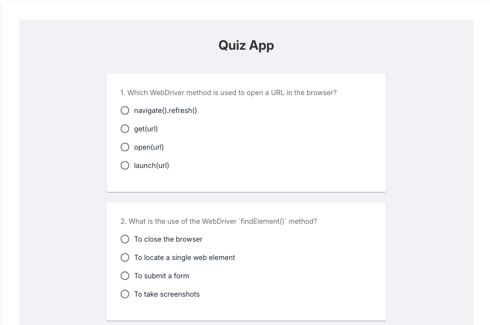
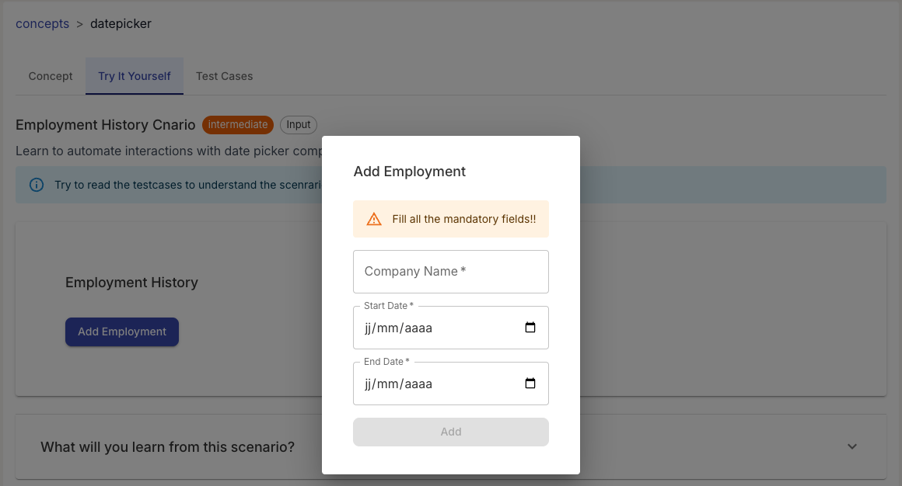

# [Cnarios](https://www.cnarios.com/) in Playwright

🚀 Challenges and real-world scenarios to learn automation using Playwright

## What is Cnarios ?

📋 Cnarios is a free platform for testers to practice automation using real-life scenarios, industry-standard test cases, and bug-finding challenges. Learn concepts, sharpen your skills, and prepare for interviews — all in one place.

👉 [www.cnarios.com](https://www.cnarios.com/)

## Challenges

Each challenge will include positive test cases, negative test cases, and edge cases.

    
Social Media (test button states)
 
    
😎👌🔥 Positive Scenarios and Edge Cases

    <table>
        <tr>
            <th>Test ID</th>
            <th>Scenario</th>
            <th>Expected Result</th>
            <th>Type</th>
            <th>Priority</th>
        </tr>
        <tr>
            <td>BTN_001</td>
            <td>Click Follow button when enabled</td>
            <td>Button text and icon should change to 'Following' with a check icon</td>
            <td>Positive</td>
            <td>High</td>
        </tr>
        <tr>
            <td>BTN_002</td>
            <td>Tooltip visibility on hover</td>
            <td>Tooltip should display 'Click to follow' or 'Click to unfollow' based on state</td>
            <td>Positive</td>
            <td>Medium</td>
        </tr>
        <tr>
            <td>BTN_003</td>
            <td>Follow button shows 'Processing...' text</td>
            <td>'Processing...' should appear before state changes and the button should be disabled</td>
            <td>Positive</td>
            <td>Medium</td>
        </tr>
        <tr>
            <td>BTN_004</td>
            <td>Click Unfollow (toggle back)</td>
            <td>Button should return to Follow state after click</td>
            <td>Positive</td>
            <td>Medium</td>
        </tr>
        <tr>
            <td>BTN_005</td>
            <td>Remove a suggestion card</td>
            <td>The selected suggestion card should be removed from the visible list</td>
            <td>Positive</td>
            <td>Medium</td>
        </tr>   
    </table>
    
🚨❗🚫 Negative Scenarios and Edge Cases

    <table>
        <tr>
            <th>Test ID</th>
            <th>Scenario</th>
            <th>Expected result / risk identified</th>
            <th>Type</th>
            <th>Priority</th>
        </tr>
        <tr>
            <td>BTN_006</td>
            <td>Unable to follow if button is desabled</td>
            <td>Button text should not change on click if button is desabled</td>
            <td>Negative</td>
            <td>Medium</td>
        </tr> 
        <tr>
            <td>BTN_007</td>
            <td>Ignore clicks near button (missed clicks)</td>
            <td>User action is not precise</td>
            <td>Negative</td>
            <td>Medium</td>
        </tr>
        <tr>
            <td>BTN_008</td>
            <td>Unable to follow if button is clicked multiple times (spam/debounce)</td>
            <td>Button is put under stress</td>
            <td>Negative</td>
            <td>Medium</td>
        </tr> 
        <tr>
            <td>BTN_009</td>
            <td>Button remains functional when visually hidden</td>
            <td>Button is visually hidden</td>
            <td>Negative</td>
            <td>Medium</td>
        </tr>  
    </table>
    
💡 Leçons tirées de ce scénario:

    
✏️ Gérer les boutons dynamiques « Suivre / Ne plus suivre »

    
✏️ Tester les états de chargement et d’inactivité des boutons

    
✏️ Vérifier le comportement au survol et des infobulles

    
✏️ Valider les transitions d’état des basculeurs

    
✏️ Tester plusieurs cartes de suggestions d’utilisateurs

    
✏️ Contrôler les modifications visuelles et textuelles

    
✏️ Gérer les clics sur les boutons avec délais

    
🏞️ 📸 🗺️ Visuel du composant sous test:

    

    
Form registration (test form validation)
 
    
😎👌🔥 Positive Scenarios and Edge Cases

    <table>
        <tr>
            <th>Test ID</th>
            <th>Scenario</th>
            <th>Expected Result</th>
            <th>Type</th>
            <th>Priority</th>
        </tr>
        <tr>
            <td>FORM_001</td>
            <td>Submit form with valid data</td>
            <td>Form should submit successfully, loader should appear, and confirmation dialog should display with generated ticket IDs</td>
            <td>Positive</td>
            <td>High</td>
        </tr>
        <tr>
            <td>FORM_002</td>
            <td>Verify Reset button functionality</td>
            <td>All fields should be cleared and tickets reset to 1</td>
            <td>Positive</td>
            <td>Low</td>
        </tr>
        <tr>
            <td>FORM_003</td>
            <td>Multiple tickets generate unique IDs</td>
            <td>Confirmation dialog should display as many ticket IDs as number of tickets entered, all unique</td>
            <td>Positive</td>
            <td>High</td>
        </tr>
        <tr>
            <td>FORM_004</td>
            <td>Close modal to return to form without losing already entered data</td>
            <td>Clicking on the button 'Close' does not submit form, nor reset any fields</td>
            <td>Positive</td>
            <td>Low</td>
        </tr>
        <tr>
            <td>FORM_005</td>
            <td>Confirm event registration</td>
            <td>Clicking on the button 'Confirm' submits the form, and resets all fields</td>
            <td>Positive</td>
            <td>High</td>
        </tr>
    </table> 
    
🚨❗🚫 Negative Scenarios and Edge Cases

    <table>
        <tr>
            <th>Test ID</th>
            <th>Scenario</th>
            <th>Expected Result</th>
            <th>Type</th>
            <th>Priority</th>
        </tr>
        <tr>
            <td>FORM_006</td>
            <td>Submit form with missing required fields</td>
            <td>Register button should remain disabled until all fields are filled correctly</td>
            <td>Negative</td>
            <td>High</td>
        </tr>
        <tr>
            <td>FORM_007</td>
            <td>Invalid name format validation</td>
            <td>Register button should remain disabled and error message is visible "Enter at least 3 characters"</td>
            <td>Negative</td>
            <td>Medium</td>
        </tr>
        <tr>
            <td>FORM_008</td>
            <td>Invalid email format validation</td>
            <td>Register button should remain disabled and error message is visible "Enter a valid email address"</td>
            <td>Negative</td>
            <td>Medium</td>
        </tr>
        <tr>    
            <td>FORM_009</td>
            <td>Invalid phone number format validation</td>
            <td>Register button should remain disabled and error message is visible "Enter a valid phone (7-15 digits)"</td>
            <td>Negative</td>
            <td>Medium</td>
        </tr>
        <tr>
            <td>FORM_010</td>
            <td>Tickets less than 1</td>
            <td>Register button should remain disabled and error message is visible "Enter an integer between 1 and 10"</td>
            <td>Negative</td>
            <td>Medium</td>
        </tr>
    </table>
    
💡 Leçons tirées de ce scénario:

    
✏️ Comprendre la structure du formulaire et les types de champs
 
    
✏️ Automatiser la saisie des données dans les champs texte et listes déroulantes
 
    
✏️ Déclencher les messages de validation du formulaire
 
    
✏️ Soumettre le formulaire et vérifier le comportement en cas de succès ou d’échec
 
    
✏️ Tester des scénarios avec des entrées valides et invalides
 
    
🏞️ 📸 🗺️ Visuel du composant sous test:

    

    
News articles feed (test checkboxes)
 
    
😎👌🔥 Positive Scenarios and Edge Cases

    <table>
        <tr>
            <th>Test ID</th>
            <th>Scenario</th>
            <th>Expected Result</th>
            <th>Type</th>
            <th>Priority</th>
        </tr>
        <tr>
            <td>NEWS_001</td>
            <td>Select one category and view filtered news</td>
            <td>Only news from the selected categories should appear</td>
            <td>Positive</td>
            <td>Medium</td>
        </tr> 
        <tr>
            <td>NEWS_002</td>
            <td>Select multiple categories and view filtered news</td>
            <td>Only news from the selected categories should appear</td>
            <td>Positive</td>
            <td>High</td>
        </tr>  
        <tr>
            <td>NEWS_003</td>
            <td>Select all categories and view news from all categories</td>
            <td>News from all categories should appear</td>
            <td>Positive</td>
            <td>Medium</td>
        </tr> 
        <tr>
            <td>NEWS_004</td>
            <td>Open and close preference dialog without changes</td>
            <td>News items before and after dialog open should match</td>
            <td>Positive</td>
            <td>Low</td>
        </tr> 
        <tr>
            <td>NEWS_005</td>
            <td>Open preference dialog, select a category, unselect same category, select same category and click on "done"</td>
            <td>News items same as before</td>
            <td>Positive</td>
            <td>Low</td>
        </tr> 
        <tr>
            <td>NEWS_006</td>
            <td>Open preference dialog, select a category, click on "done" and open dialog again</td>
            <td>The selected category should be checked</td>
            <td>Positive</td>
            <td>Medium</td>
        </tr>
        <tr>
            <td>NEWS_007</td>
            <td>Open preference dialog, select a category, click outside the dialog</td>
            <td>The selected category should be checked and news list updated</td>
            <td>Positive</td>
            <td>Low</td>
        </tr>       
    </table>
    
🚨❗🚫 Negative Scenarios and Edge Cases

    <table>
        <tr>
            <th>Test ID</th>
            <th>Scenario</th>
            <th>Expected result / risk identified</th>
            <th>Type</th>
            <th>Priority</th>
        </tr>
        <tr>
            <td>NEWS_008</td>
            <td>Unselect all categories</td>
            <td>A message indicating no news should be displayed</td>
            <td>Negative</td>
            <td>Medium</td>
        </tr> 
        <tr>
            <td>NEWS_009</td>
            <td>Click multiple times on the button "done"</td>
            <td>The system must not handle multiple requests</td>
            <td>Negative</td>
            <td>Medium</td>
        </tr> 
    </table>
    
💡 Leçons tirées de ce scénario:

    
✏️ Automatiser la sélection et la désélection des cases à cocher
  
    
✏️ Vérifier les valeurs des cases cochées
  
    
✏️ Gérer les états par défaut et les cases pré-cochées
  
    
✏️ Interagir avec les libellés pour modifier l’état des cases à cocher
     
    
🏞️ 📸 🗺️ Visuel du composant sous test:

     

    
Quizz App (test radio inputs)
 
    
😎👌🔥 Positive Scenarios and Edge Cases

    <table>
        <tr>
            <th>Test ID</th>
            <th>Scenario</th>
            <th>Expected Result</th>
            <th>Type</th>
            <th>Priority</th>
        </tr>
        <tr>
            <td>QUIZ_001</td>
            <td>Submit quiz with all correct answers</td>
            <td>Score displays as full and result shows 'Pass 🎉'</td>
            <td>Positive</td>
            <td>High</td>
        </tr>    
        <tr>
            <td>QUIZ_002</td>
            <td>Submit quiz with partials correct answers (3 correct, 1 incorrect)</td>
            <td>Score is accurate, and result shows Pass if ≥60%, else Fail</td>
            <td>Positive</td>
            <td>Medium</td>
        </tr>  
        <tr>
            <td>QUIZ_003</td>
            <td>Submit quiz and click on 'Try Again'</td>
            <td>The quiz should be reset and all choices not selected</td>
            <td>Positive</td>
            <td>High</td>
        </tr>
    </table>
    
🚨❗🚫 Negative Scenarios and Edge Cases

    <table>
        <tr>
            <th>Test ID</th>
            <th>Scenario</th>
            <th>Expected result / risk identified</th>
            <th>Type</th>
            <th>Priority</th>
        </tr>
        <tr>
            <td>QUIZ_004</td>
            <td>Submit quiz with all incorrect answers</td>
            <td>Score should be 0 and result should show 'Fail ❌'</td>
            <td>Negative</td>
            <td>High</td>
        </tr>  
        <tr>
            <td>QUIZ_005</td>
            <td>Submit without answering any questions</td>
            <td>Score should be 0 and 'Fail ❌' should be shown</td>
            <td>Negative</td>
            <td>Medium</td>
        </tr> 
        <tr>
            <td>QUIZ_006</td>
            <td>Submit quiz with partials correct answers (2 correct, 2 incorrect)</td>
            <td>Score is 2/4, and result shows 'Fail ❌'</td>
            <td>Negative</td>
            <td>Medium</td>
        </tr> 
        <tr>
            <td>QUIZ_007</td>
            <td>Change answer in the same question</td>
            <td>Select one answer, then select another answer from the same question and verify selection</td>
            <td>Negative</td>
            <td>Medium</td>
        </tr> 
        <tr>
            <td>QUIZ_008</td>
            <td>Quiz resets if user leaves the page</td>
            <td>Select one or two answers, leave the page and check for quiz resets</td>
            <td>Negative</td>
            <td>Medium</td>
        </tr> 
        <tr>
            <td>QUIZ_009</td>
            <td>Select one or multiple wrong answers</td>
            <td>Good answers are colored in red and selected wrong answers in green</td>
            <td>Negative</td>
            <td>Medium</td>
        </tr> 
    </table>    
    
🏞️ 📸 🗺️ Visuel du composant sous test:

     

    
Date Picker (test selection of dates)
 
    
😎👌🔥 Positive Scenarios and Edge Cases

    <table>
        <tr>
            <th>Test ID</th>
            <th>Scenario</th>
            <th>Expected Result</th>
            <th>Type</th>
            <th>Priority</th>
        </tr>
        <tr>
            <td>EMP_001</td>
            <td>Add a valid employment record</td>
            <td>Employment entry should appear in the list without errors</td>
            <td>Positive</td>
            <td>High</td>
        </tr>
        <tr>
            <td>EMP_002</td>
            <td>Add multiple non-overlapping employment records</td>
            <td>All records should be saved and displayed correctly</td>
            <td>Positive</td>
            <td>Medium</td>
        </tr>
        <tr>
            <td>EMP_003</td>
            <td>Add employment with same start and end date</td>
            <td>Record should be added if allowed by business logic</td>
            <td>Positive</td>
            <td>Low</td>
        </tr> 
        <tr>
            <td>EMP_004</td>
            <td>Open employment modal and cancel without saving</td>
            <td>Modal closes and no new data is added</td>
            <td>Positive</td>
            <td>Low</td>
        </tr>
        <tr>
            <td>EMP_005</td>
            <td>Remove an employment</td>
            <td>The removed employment should not appear in the list</td>
            <td>Positive</td>
            <td>High</td>
        </tr>       
    </table>
    
🚨❗🚫 Negative Scenarios and Edge Cases

    <table>
        <tr>
            <th>Test ID</th>
            <th>Scenario</th>
            <th>Expected result / risk identified</th>
            <th>Type</th>
            <th>Priority</th>
        </tr>
        <tr>
            <td>EMP_006</td>
            <td>Try adding overlapping employment dates</td>
            <td>Warning should be shown and record should not be added</td>
            <td>Negative</td>
            <td>High</td>
        </tr> 
        <tr>
            <td>EMP_007</td>
            <td>Try adding a job without selecting any date</td>
            <td>Form should show validation error and block submission</td>
            <td>Negative</td>
            <td>High</td>
        </tr>
        <tr>
            <td>EMP_008</td>
            <td>Try adding a job where end date is before start date</td>
            <td>Validation message should be shown and form should not submit</td>
            <td>Negative</td>
            <td>Medium</td>
        </tr>  
    </table>
    
🪲🐞🐝 Bug(s) Found

    <table>
        <tr>
            <td>Test ID</td>
            <td>EMP_008</td>
        </tr>    
            <td>Title</td>
            <td>Try adding a job where end date is before start date</td>
        </tr>    
            <td>Priority</td>
             <td>High</td>
        </tr>    
            <td>Environment</td>
             <td>Production - site cnarios.com (Navigateur Chrome 124, Windows 11)</td>
        </tr>    
            <td style="vertical-align: top;">Description</td>
            <td>
                <ol>
                    <li>Go to challenge page DatePicker</li>
                    <li>Click on the button "Add Employment</li>
                    <li>Enter a name of a company (ex:Google)</li>
                    <li>Add a start date 01/01/2024</li>
                    <li>Add an end date 01/01/2023 (before start date)</li>
                    <li>Click on button 'Add'</li>
                </ol>
            </td>
        </tr>    
            <td style="vertical-align: top;">Expected result</td>
            <td>The button 'Add' should be <code>disabled</code> preventing submission or an error message should be displayed explaining the error.</td>
        </tr>    
            <td>Actual result</td>
            <td>The entry was successfully added</td>
        </tr>    
        </tr>
        <tr>
    </table>
    
💡 Leçons tirées de ce scénario:

    
✏️ Automatiser la sélection de dates uniques et de plages de dates.

    
✏️ Gérer les sélecteurs de dates (date pickers) natifs et personnalisés.
  
    
✏️ Vérifier les dates sélectionnées dans les champs de saisie.
  
    
✏️ Tester les restrictions de dates minimales et maximales.
  
    
✏️ Gérer la navigation dans le calendrier et la validation des données.
       
    
🏞️ 📸 🗺️ Visuel du composant sous test:

     

## 🧱 Architecture

✅ Page Object Model (POM) -> une classe par page qui contient sélecteurs et méthodes

✅ Fixtures personnalisées pour une configuration de test réutilisable

✅ Pipeline (GitHub Actions) optimisé sous Docker et stratégie de parallélisation

✅ Séparation des données de tests de la logique

✅ Architecture propre et évolutive

## 🗂️ Structure du projet

<pre>
.
├── .github/
│   └── workflows/
│       └── cnarios-playwright.yaml   # Pipeline CI/CD pour Playwright
├── assets/                           # Ressources statiques
├── e2e/                              # Cœur des tests de bout en bout
│   ├── data/                         # Dossier des données de test
│   │   └── formRegistrationData.ts   # Données de test ou types TS
│   │   └── quizAppData.ts            # Données de test ou types TS
│   ├── fixtures/                     # Dossier des fixtures
│   │   └── fixtures.ts               # Extension du test Playwright
│   ├── pages/                        # Page Object Model (POM)
│   │   ├── BasePage.ts               # Classe parente avec méthodes communes
│   │   ├── ButtonPage.ts             # Classe TS composant bouton type button
│   │   └── CheckboxPage.ts           # Classe TS composant checkbox
│   │   └── DatePickerPage.ts         # Classe TS composant datepicker
│   │   └── FormRegistrationPage.ts   # Classe TS composant formulaire
│   │   └── RadioButtonPage.ts        # Classe TS composant boutton type radio
│   └── tests/                        # Dossier des spécifications (specs)
│       ├── button.spec.ts            # Tests du composant bouton type button
│       ├── checkbox.spec.ts          # Tests du composant checkbox
│       ├── datepicker.spec.ts        # Tests du composant datepicker
│       └── formRegistration.spec.ts  # Tests du composant formulaire
│       └── radioButton.spec.ts       # Tests du composant bouton type radio
├── node_modules/                     # Dépendances NPM
├── playwright-report/                # Rapports générés après exécution
│   ├── data/
│   ├── trace/                        # Traces zip pour le debugging profond
│   └── index.html                    # Rapport HTML interactif
├── test-results/                     # Artefacts de tests (screenshots/vidéos)
├── .gitignore
├── Helpers.md                        # Documentation d'aide
├── package-lock.json
├── package.json                      # Scripts et dépendances du projet
├── playwright.config.ts              # Configuration globale de Playwright
└── README.md                         # Documentation principale
</pre>

## ⚙️ Pipeline GitHub Actions

<pre>
name: Playwright Tests

on:
  push:
    branches: [main, develop]
    paths:
      - 'e2e/**'
      - 'playwright.config.ts'
      - 'package.json'
      - 'package-lock.json'
      - '.github/workflows/cnarios-playwright.yaml'

  pull_request:
    branches: [main]
    paths:
      - 'e2e/**'
      - 'playwright.config.ts'
      - 'package.json'

jobs:
  playwright-run:
    runs-on: ubuntu-latest
    container:
      image: mcr.microsoft.com/playwright:v1.58.2-jammy

    strategy:
      fail-fast: true
      matrix:
        shardIndex: [1, 2, 3] # On lance 3 machines
        shardTotal: [3]

    steps:
      - name: Checkout
        uses: actions/checkout@v4

      - name: Setup Node.js and Cache
        uses: actions/setup-node@v4
        with:
          node-version: 18
          cache: 'npm'

      - name: Install dependencies
        run: npm ci

      - name: Run Playwright tests
        run: npx playwright test --shard=${{ matrix.shardIndex }}/${{ matrix.shardTotal }} --reporter=blob

      - name: Upload blobreport
        if: always()
        uses: actions/upload-artifact@v4
        with:
          name: all-blob-reports-${{ matrix.shardIndex }}
          path: blob-report/
          retention-days: 1

  merge-reports:
    if: always()
    needs: [playwright-run]
    runs-on: ubuntu-latest
    steps:
      - name: Checkout
        uses: actions/checkout@v4

      - name: Setup Node
        uses: actions/setup-node@v4
        with:
          node-version: 18

      - name: Install dependencies
        run: npm ci

      - name: Download all blobs
        uses: actions/download-artifact@v4
        with:
          pattern: all-blob-reports-*
          path: all-blob-reports
          merge-multiple: true

      - name: Merge into HTML Report
        run: npx playwright merge-reports --reporter html ./all-blob-reports

      - name: Upload final HTML report
        uses: actions/upload-artifact@v4
        with:
          name: playwright-report
          path: playwright-report/
          retention-days: 30

</pre>

📍 A propos du pipeline

- Stratégie de déclenchement intelligente (filtering) grâce au mot-clé <code>paths</code> 
- Ciblage des branches en limitant lest tests lourds à <code>main</code> et <code>develop</code> 
- Environnement figé grâce à l'utilisation de l'image Docker officielle 
- L'image Docker inclue les dépendances systèmes nécessaires pour un gain de temps 
- Utilisation de la <code>matrix</code> pour exécuter les tests en parallèle et réduire le temps d'exécution 
- Le <code>fail-fast: true</code> pour stopper le pipeline en cas d'erreurs 
- Gestion avancée du cache et des dépendances avec <code>actions/setup-node</code> et <code>cache: npm</code> 
- Utilisation de <code>npm ci</code> (Clean Install) qui garantit l'installation des bonnes versions des dépendances 
- Architecture de reporting et gestion des artifacts 
- Suppression des blobs temporaires après 1 jour et du rapport final après 30 jours
